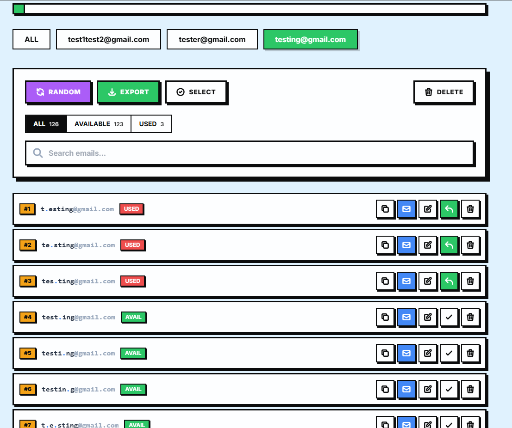
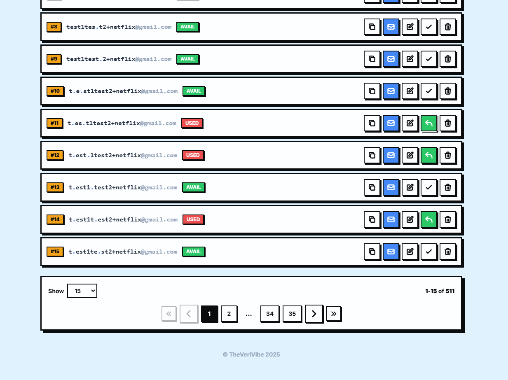
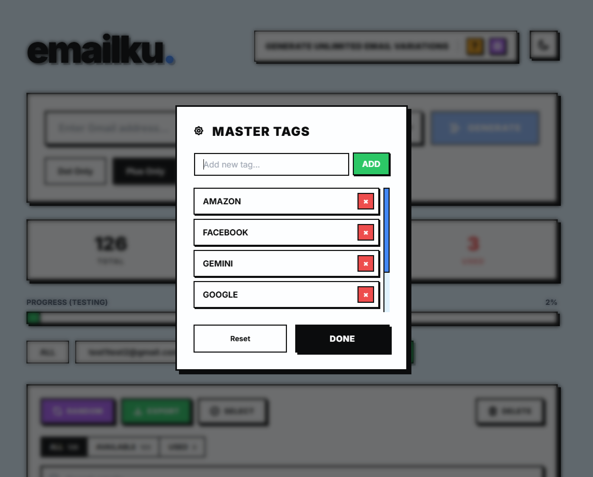

<div align="center">

# emailku.


### Generate Unlimited Email Variations with Style

[](https://emailku.vercel.app)
[](https://nextjs.org/)
[](https://www.typescriptlang.org/)
[](https://tailwindcss.com/)

*Exploits Gmail's dot-ignoring behavior and plus-addressing feature to create infinite aliases from a single account.*

</div>

---

## Preview

<div align="center">

### Homepage


</div>

<details>
<summary><b>View More Screenshots</b></summary>

<br>

### Dot Mode - Email Variations


### Plus Mode - Tagged Emails  


### Master Tags Management


</details>

---

## Features

### Generation Modes

| Mode | Description | Example |
|:---:|:---|:---|
| **Dot Only** | Adds random dots to username | `e.mail@gmail.com` |
| **Plus Only** | Appends tags using plus sign | `email+netflix@gmail.com` |
| **Mixed** | Combines both techniques | `e.mail+work@gmail.com` |

### Core Features

- **Neo-Brutalism Design** - Bold typography, hard shadows, high contrast
- **Dark Mode** - Easy on the eyes, available out of the box
- **100% Local Storage** - No server, your data stays in your browser
- **Offline Capable** - Works without internet once loaded
- **Master Tags** - Manage favorite tags (Netflix, Work, Social, etc.)
- **History Tracking** - Track used/available emails with notes
- **CSV Export** - Download your entire list
- **Keyboard Shortcuts** - For power users

---

## Quick Start

```bash
# Clone repository
git clone https://github.com/verifydream/emailku.git
cd emailku

# Install dependencies
npm install

# Run development server
npm run dev
```

Open [http://localhost:3000](http://localhost:3000) in your browser.

---

## Keyboard Shortcuts

| Key | Action |
|:---:|:---|
| `Ctrl + R` | Pick random available email |
| `Ctrl + E` | Export list to CSV |
| `Ctrl + K` | Focus search bar |
| `Escape` | Cancel / Close modals |
| `?` | Toggle shortcuts menu |

---

## Tech Stack

| Technology | Purpose |
|:---:|:---|
| [Next.js 14](https://nextjs.org/) | React Framework |
| [TypeScript](https://www.typescriptlang.org/) | Type Safety |
| [Tailwind CSS](https://tailwindcss.com/) | Styling |
| Local Storage | Data Persistence |

---

<div align="center">

## License

**TheVeriVibe 2025**

*Created with passion and caffeine.*

---

If you find this project useful, please consider giving it a star!

</div>
